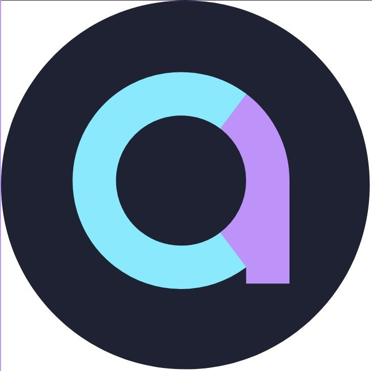

+++
title="Designing my own logo"
date=2023-04-22
template="post.html"

[extra]
image="designing-my-own-logo.png"
+++

In this post, I will share the creation process of my logo that I did back in October.

Before doing any sketch work, I thought about the main guidelines the logo should follow:

1. **Not bounded to a certain topic**. The logo should represent myself, not my interests. This means that no reference to programming, for example.

2. **Not bounded to a certain medium**. The logo should be easily resizable and adaptable to screens, print, stamps, etc. This rules out shades, for example.

3. **No hidden meanings**. Anyone should be able to understand the logo and why it represents me, without prior knowledge of myself nor an explanation for it.

With these in mind, I started designing. I used *Fusion360*, as I am quite confident with the sketching tool. The precise dimensions and history feature helped me tweak the design quickly.

The main idea of the design was overlapping the letters *"a"* and *"c"* (of Albert Canales, obviously) into a single letter, accomplishing the effect of seeing both simultaneously. This first design look like so:

<figure>
    
    <figcaption>
        First design with Fusion360
    </figcaption>
</figure>

From this idea, I tried playing with line width and angles. My recommendation when polishing a design is to try *everything*, as you are not really sure of how a design will look until you test it.

The most significant change I did was adding the *"r"* for Ros, my second last name. However, this addition cluttered the design with too much information for my liking. It also made the logo wider than taller, which was a problem because I wanted a circle around it. So I finally ditched the idea.

<figure>
    
    <figcaption>
        Adding the letter "r"
    </figcaption>
</figure>

Now that the elements of the design were clear, I continued with color in order to have a more definitive look. The colors were inspired by the [Dracula theme](https://draculatheme.com/) (used on my website too). I also added the circle mentioned above.

<figure>
    
    <figcaption>
        Adding color
    </figcaption>
</figure>

Now, I clearly saw that the rounded background did not match with the many square corners of the front's design. To solve this, I tried simplifying the letter, and obtained a much cleaner version.

<figure>
    
    <figcaption>
        Rounding the letter
    </figcaption>
</figure>

Now that the design was more or less clear, all the black lines from the *Fusion360* viewer were preventing me from seeing a more definitive version. It was time to start designing with a more appropriate tool.

I wanted a vectorial drawing tool that still allowed me to tweak a parametrized version of the logo. Because of my previous experience on the [Reading Timeline](@/blog/reading-timeline.md) project, I decided to go with the [svgwrite](https://pypi.org/project/svgwrite/) Python's library.

With the lines removed, I also saw that the true Dracula colors would fit nicely.

<figure>
    
    <figcaption>
        Python's first version of the logo
    </figcaption>
</figure>

At this point, I also did some tests with the angle of the letter *"c"*. I tried going over the vertical line of the *"a"* and stopping just before it. It was the second option that gave my friend Pablo a great idea.

<figure>
    
    <figcaption>
        The letter "c" overlapping the vertical line
    </figcaption>
</figure>

<figure>
    
    <figcaption>
        The letter "c" stopping just at the vertical line
    </figcaption>
</figure>

Pablo suggested adding a small gap between the letters. I had not thought about it, but it clearly was great.

<figure>
    
    <figcaption>
        Adding the gap
    </figcaption>
</figure>

Thanks to this idea, I could come up with the final design. The square shape of the right-lower tip was really bothering me, so why not expand this gap to eat a chunk of it? I think that this small change really did the trick!

<figure>
    
    <figcaption>
        Final design
    </figcaption>
</figure>

Finally, that's my personal logo. You can look at the Python's code [here](logo.py). Beware, it was done quickly and just for this specific task, so prepare for some hideous code!

Each personal logo is different, and thus the processes for its design can also differ vastly. However, if you want to make yours similarly, I would suggest the following ideas:

- Before designing with a computer at all, have a clear idea of which elements and general composition you want to have, using strict guidelines if needed.

- When designing, always use the tool that maximizes tweaking possibilities (in both ease of modification and visualization of the changes)

- Change to a more sophisticated tool only when the current one limits your ability to view the design's flaws.

That said, I hope I have motivated you to design your own logo and gave you some ideas on how to do it.

Cheers!

* * *

*For any suggestion on comment, don't hesitate to [contact me](mailto:contact@albertcanales.com)*

*Thanks for reading!*
