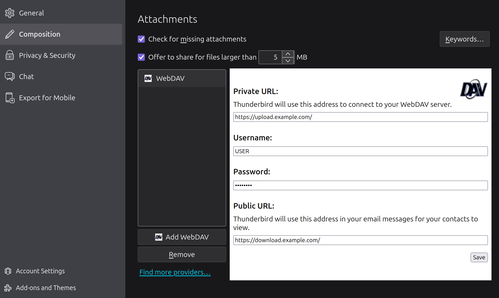
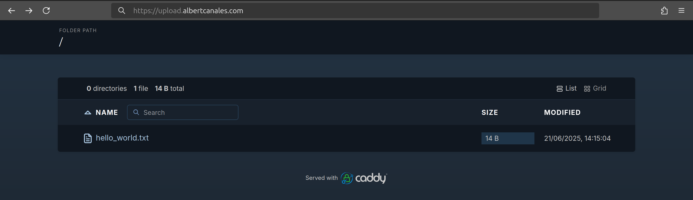
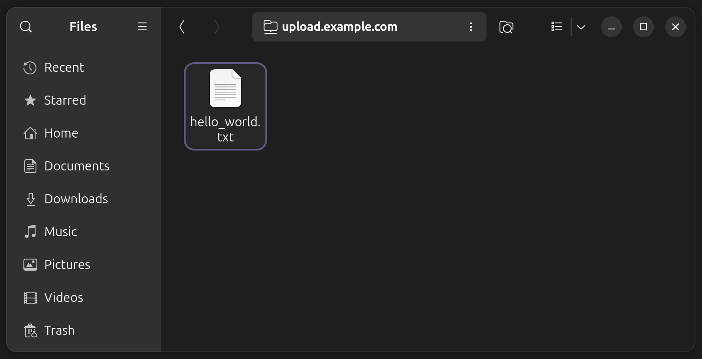
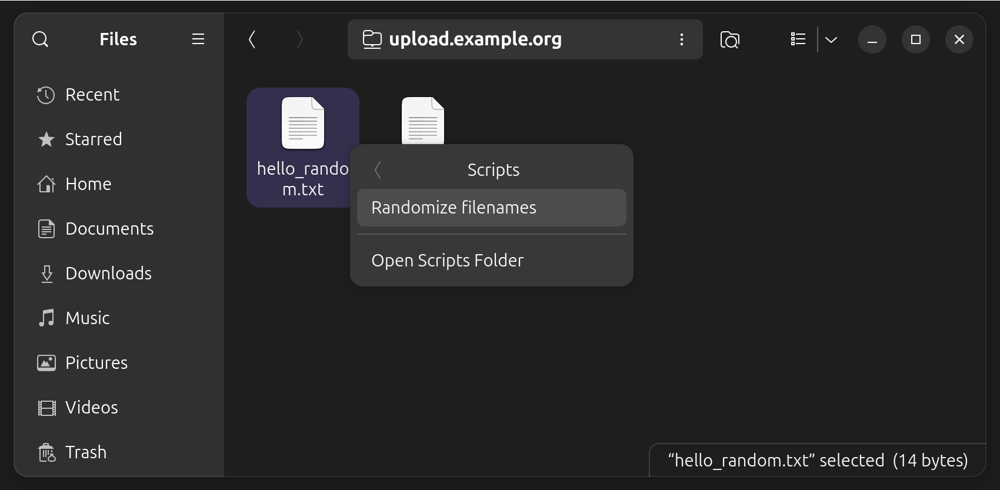
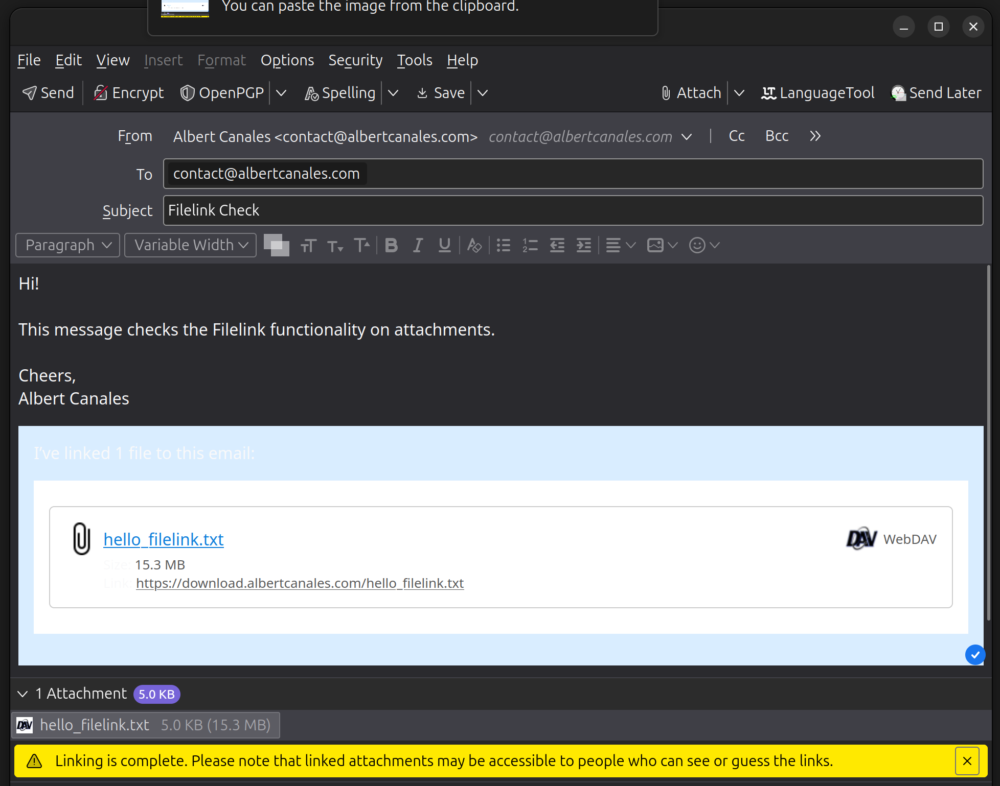

+++
title="Setting Up a Self-Hosted WebDAV Server for Thunderbird Filelink"
date=2025-07-14
template="post.html"
+++

This post explains how to easily share files from your VPS using WebDAV, without the limitations of any cloud providers, motivated by the need to send large attachments through Thunderbird using the Filelink feature. I've been using this for nearly a year now, and I'm very pleased with the experience!

## Motivation

Around a year ago I received the following warning while adding an attachment to a message on Thunderbird:

> _This is a large file. It might be better to use Filelink instead._

As most of you, I was already familiar with a similar feature in Gmail's web client, where the user is *forced* to add the large files to Google Drive and a link is sent in its place. The main reason behind it seems to be that, as email is based on very old protocols, abuse of large attachments can become a bit of a headache for sysadmins by saturating the network and databases. To avoid the issue, a hard limit on attachment sizes is typically imposed.

Thunderbird comes with [Filelink](https://support.mozilla.org/en-US/kb/filelink-large-attachments) which, via a single click, allows you to upload large attachments to your storage provider of choice and, in its place, send only a link to it. Very similar to Google's, but with more choices!

In this post I'll touch on the two provider options I liked the most, explain why I chose one instead of the other, and show you how to configure it securely on your own. In fact, what I'll explain is not limited to attachment-sharing with Filelink, it allows easy file-sharing from your VPS in a general sense. If you are not interested in the Thunderbird part, feel free to jump directly to [the implementation](#webdav). 

## Choosing a provider

There are a handful of providers available to use Filelink, each of which has its corresponding add-on that you have to install. You can find a list of all add-ons (and thus, all providers available) [here](https://addons.thunderbird.net/thunderbird/tag/filelink/).

Some of them let you let you use your account on some cloud storage provider like [Dropbox](https://addons.thunderbird.net/en-US/thunderbird/addon/filelink-provider-for-dropbox/?src=search) or [Box](https://addons.thunderbird.net/en-US/thunderbird/addon/filelink-provider-for-box/?src=search). This is the simplest option, but I prefer using my own infrastructure instead of relying on some cloud solution whenever possible.

Lucky for me, there are also many options that give room to self-hosting. The most interesting couple are [Send](https://addons.thunderbird.net/en-US/thunderbird/addon/filelink-provider-for-send/?src=search) and [WebDAV](https://addons.thunderbird.net/en-US/thunderbird/addon/filelink-provider-for-webdav/?src=search). Note that Send may also be used without the need to self-host by uploading the files to one of the [public instances available](https://github.com/timvisee/send-instances/).

Before delving deeper into each one, let's lay down my requirements:

1. Only I should be able to upload, remove, and list all files of the server.
2. Uploaded files should be accessible for reading to anyone who has the link to it.
3. Uploaded files should be accessible for reading until manually removed, without expiration dates.
4. File links should be randomized in some way for security reasons, so links cannot be easily guessed.

### Send

Firefox used to offer a provider of their own called *Firefox Send*. Sadly, [it was discontinued in 2020](https://support.mozilla.org/en-US/kb/what-happened-firefox-send) due to being used to spread malware[^1].

However, as the code itself was open source, a fork is still maintained under the name [Send](https://github.com/timvisee/send). If you do wish to self-host it, you may use Docker as explained [here](https://github.com/timvisee/send/blob/master/docs/docker.md).

Send is easy to deploy and works perfectly. It uses different endpoints for uploading and retrieving, so I can easily protect the former with some authentication to comply with the first requirement. It also provides a really nice UI for uploading the files, which is always a plus. Last but not least, it also randomizes the links, fulfilling all my security-related requirements.

Sadly, it does not pass the third requirement, as you *must* select an expiration date for the file. This is a good idea for public instances, but an unneeded restriction if I'm the only one allowed to upload. There are a couple of related issues regarding the topic ([#21](https://github.com/timvisee/send/issues/21) and [#179](https://github.com/timvisee/send/issues/179)) and, to be honest, shouldn't be that hard to implement myself. I may actually do it someday.

Send is a great option and very beginner friendly. It's not a perfect fit for me out of the box, but I could easily make it so and, in addition, contribute a bit to FOSS. The reason I didn't take it is that I found the simplistic approach (in terms of functionality) offered by WebDAV more appealing.

### WebDAV

As explained on [their website](http://www.webdav.org/): *[WebDAV] is a set of extensions to the HTTP protocol which allows users to collaboratively edit and manage files on remote web servers*. From the user's side, it is a very simple and bare-bones implementation of the file-sharing we want to accomplish and, by being a standard, offers great integration with other software. Nonetheless, and similarly to Send, it does not fulfill all my requirements by default, missing the fourth. A quick Python script will take care of that.

There is WebDAV support through extensions for the most HTTP Servers: [Apache](https://httpd.apache.org/docs/2.4/mod/mod_dav.html), [Nginx](https://nginx.org/en/docs/http/ngx_http_dav_module.html) and [Caddy](https://github.com/mholt/caddy-webdav). As a big Caddy fan myself, I'll choose the latter. I'll also be using Docker for all the deployment, as it makes my life much easier in the long run.

## WebDAV Implementation with Docker and Caddy

For this section I will be assuming a basic knowledge of Docker and Docker Compose, although all given configurations should be plug and play. What I'll be showing is pretty standard anyway, nothing out of the ordinary.

We want to implement two endpoints:

- `upload.example.com`: Gives full access to the uploaded files (upload, remove, and list). It should be protected.
- `download.example.com`: Allows for retrieval of the uploaded files. No authentication needed.

I'm using `example.com` as an example domain name here, but you should obviously replace it with your own. Also, feel free to rename the endpoints to your liking, or even skip DNS entirely and expose each endpoint to a different port. In any case, make sure to use HTTPS instead of HTTP, or your passwords will be traversing the Internet in plain text! This step will become trivial when using Caddy.

### Running Caddy with Docker

Similarly to what happened in [my previous post](./homeserver-ssl-with-caddy.md), Caddy does not include WebDAV support out of the box. We have to add the module ourselves to the Docker image, which can be simply done with this `Dockerfile`:

```dockerfile
FROM caddy:builder AS builder

RUN xcaddy build \
    --with github.com/mholt/caddy-webdav

FROM caddy

COPY --from=builder /usr/bin/caddy /usr/bin/caddy
```

We configure the Caddy container using Docker Compose by creating the following `compose.yml` file.

```yml
version: '2.2' 
services:
  caddy:
    build: .
    container_name: caddy
    restart: unless-stopped 
    ports:
      - '80:80'
      - '443:443'
      - '443:443/udp'
    volumes:
      - ./conf:/config
      - ./caddy/:/etc/caddy
      - caddy_data:/data
      - webdav_data:/srv/webdav
```

This Docker Compose configuration is taken from the [official Caddy image](https://hub.docker.com/_/caddy), with a couple key changes. First, we are building the custom Caddy image we just prepared instead of the base one. Secondly, we have added a `webdav_data` volume, where uploaded files will be persisted.

Before proceeding, it would be interesting to do a health check. By visiting the the address of your machine from the browser, you should be able to see the Caddy welcome page. Make sure you get Caddy working before proceeding!

### Configuring Caddy

With Caddy working, it's time to set up the two aforementioned endpoints. Using the examples of the [caddy-webdav](https://github.com/mholt/caddy-webdav) plugin itself, we can can derive the following configuration which should be saved in `conf/Caddyfile`:

```caddyfile
{
  order webdav before file_server
}

upload.example.com {
  root /srv/webdav/data
  basic_auth {
     USER PASS_HASH
  }
  @notget not method GET
  webdav @notget
  file_server browse
}

download.example.com {
  root /srv/webdav/data
  file_server
}
```

Let me quickly explain the configuration. For the *download* endpoint, we just want to serve the files in WebDAV's `data` directory. If the file does not exist, it will automatically return a 404. For the *upload* endpoint, we add authentication to all requests with the `basic_auth` directive. Obviously, you should provide the values for `USER` and `PASS_HASH` yourself. The `PASS_HASH` should be generated by using a hashing algorithm like *bcrypt*. Take a look at [the documentation](https://caddyserver.com/docs/caddyfile/directives/basic_auth) for more details. Next, if the request's method is *GET*, the corresponding file will be served or, in case it's a directory, its contents will be listed thanks to the addition of the `browse` parameter. If it is not *GET*, the `webdav` directive will take care of the file-uploading functionality. Lastly, note that the `notget` matcher is negated because of the `order` for the `webdav` directive defined above.

#### Using wildcard certificates

Alternatively, one may prefer to use a wildcard certificate for both subdomains. Note that this would require extra configuration of the [ACME-DNS module](https://caddyserver.com/docs/modules/dns.providers.acmedns), similarly to the one I explained in my [last post](./homeserver-ssl-with-caddy.md). As this configuration depends on your DNS provider, I will not enter into more detail. More information is found in the [documentation](https://caddyserver.com/docs/automatic-https#wildcard-certificates).

If you prefer this approach, the Caddy configuration should look as such:

```caddyfile
{
  order webdav before file_server
}

*.example.com {
  tls {
    # This requires extra configuration!!! More details here:
    # https://caddy.community/t/how-to-use-dns-provider-modules-in-caddy-2/8148
    dns <provider_name> [<params...>]
  }

  root /srv/webdav/data

  @webdav host webdav.example.com
  basic_auth @webdav {
     USER PASS_HASH
  }
  @notget not method GET
  handle @webdav {
    file_server browse
    webdav @notget
  }

  @download host download.example.com
  handle @download {
      file_server
  }

  # Fallback for otherwise unhandled domains
  handle {
    abort
  }
}
```

### File uploading and name randomisation with Nautilus

WebDAV itself does not offer any fancy WebUI for file uploading like Send does; it offers something much better. By being part of a standard, many third-party file browser applications are compatible with it by default.

I'll focus my explanation on Nautilus, the default file browser for Ubuntu[^2], but feel free to use any other application if it better fits to your workflow. The configuration may change slightly, but I'll follow the same general steps.

In Nautilus, simply click on *Other Locations* at the bottom left and, in the textbox at the bottom, write `davs://upload.example.com/` and click *Connect*. After entering the login details, you should be able to read the WebDAV data directory and upload files to it as if accessing any other directory on your machine! Seamless integration without any effort. As a bonus, you might want to bookmark the location on the left menu and enable credential saving to avoid being prompted for them every single time.

Use the [next section](#checks-and-usage) to troubleshoot any issues with accessing the WebDAV server through Nautilus.

This method of uploading files is very comfortable, but it does not pass the requirement of randomizing of the URLs. We can hack around this issue by randomizing the name of the file itself.

We would like to have an option called "Randomize filenames" when right-clicking a file (or a group of them) from the file browser. We can achieve that in Nautilus by creating a file called *Randomize filenames* in `~/.local/share/nautilus/scripts` with the following content:

```python
#!/bin/python

import os
import sys
import string
import random
from pathlib import Path


RAND_STR_LEN = 8

alphanumeric_list = string.ascii_lowercase + string.ascii_uppercase + string.digits

for filename in sys.argv[1::]:
  suffixes = ''.join(Path(file).suffixes)
  basename = file.removesuffix(suffixes)
  rand_str = ''.join(random.choices(alphanumeric_list, k=RAND_STR_LEN))
  new_filename = basename + "-" + rand_str + suffixes
  os.rename(filename, new_filename)
  print(f"Renamed {filename} to {new_filename}")
```

Also give the file execute permissions and restart Nautilus with `nautilus -q; nautilus;`. More information in [this](https://askubuntu.com/a/672553) AskUbuntu answer.

The script itself is pretty straightforward. For each filename given as input (e.g. `example_script.sh.j2`) it separates the basename (`example_script`) from the suffixes (`.sh.j2`) and inserts a random alphanumeric string of length `RAND_STR_LEN` in between (resulting in something like `example_script-XIiK7PSh.sh.j2`). Finally, the file is renamed to the randomized version.

### Setting up Thunderbird Filelink

Finally, let's configure Thunderbird's Filelink to use our WebDAV server. Install the WebDAV Filelink add-on from the Add-on Manager, located in the *Add-ons and Themes* section of the configuration. Simply search for the *FileLink provider for WebDAV*, you should find the one created by Geoff Lankow and John Bieling.

Now go to the *Composition* section of the settings and scroll down until you find the *Attachments* subsection. Click on *Add WebDAV* and fill in the server details with your configuration as such:



As a final side note, there is an open [issue](https://github.com/thunderbird/webdav-filelink/issues/2) and [PR](https://github.com/thunderbird/webdav-filelink/pull/4) regarding filename randomization directly by the Filelink for WebDAV add-on, which would be useful as it could replace our hacky solution with Nautilus.

### Checks and Usage

No more configuration needed! Before calling it a day, it would be nice to perform some final checks. I'll also be useful to get a feel for the capabilities and workflow of the overall system.

Manually upload a plain text file into the WebDAV directory (located in `/var/lib/docker/volumes/webdav_data/_data/data` for the host machine) and start the containers with `docker compose up`. Now visit the URL for the file (e.g., `downloads.example.com/hello_world.txt`). You should be able to read the file from your browser!

To check the authentication and listing capabilities of the *upload* endpoint, simply visit `upload.example.com`. HTTPS should be enabled and, after filling the password prompt, you should see something like this:



Now let's upload a file properly with Nautilus. Open the WebDAV directory on Nautilus and you should see the previously created file. Create a new file, right-click it, and select *Scripts > Randomize filenames*. The filename should now have a random string inserted. Visit the new URL to retrieve the file.





Finally, we'll check the functionality with Filelink. You'll need a file large enough to trigger the Filelink warning, like [this one](https://download.albertcanales.com/hello_filelink.txt) (save it with `Ctrl+S`). Randomize its name (I didn't do it in the screenshots) and attach it to a message on Thunderbird.


A new *Link* option has appeared! Just click it and wait for the file to be uploaded to WebDAV.



Congrats! Everything works :). Now you can share files with family and friends without depending on cloud storage providers. Additionally, you can attach them to your email messages with ease.

* * *

[^1]: I'm such an slow writer that, in the time it took me to finish the post, the Thunderbird team resurrected Firefox Send as part of their Thundermail email service. You can find the announcement [here](https://blog.thunderbird.net/2025/04/thundermail-and-thunderbird-pro-services/).

[^2]: I feel that I have to justify my OS choice for the Linux power users. *How can a nerd running Linux since 2016 still use Ubuntu?* I plan to answer that question in an upcoming post detailing my entire Linux journey: from plain Ubuntu to Arch Linux and back. I'll link it here when finished.

* * *

*For any suggestion on comment, don't hesitate to [contact me](mailto:contact@albertcanales.com)*

*Thanks for reading!*
